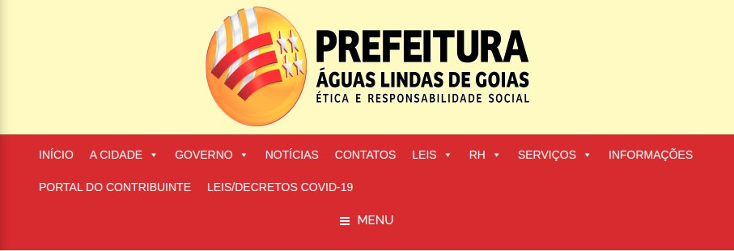
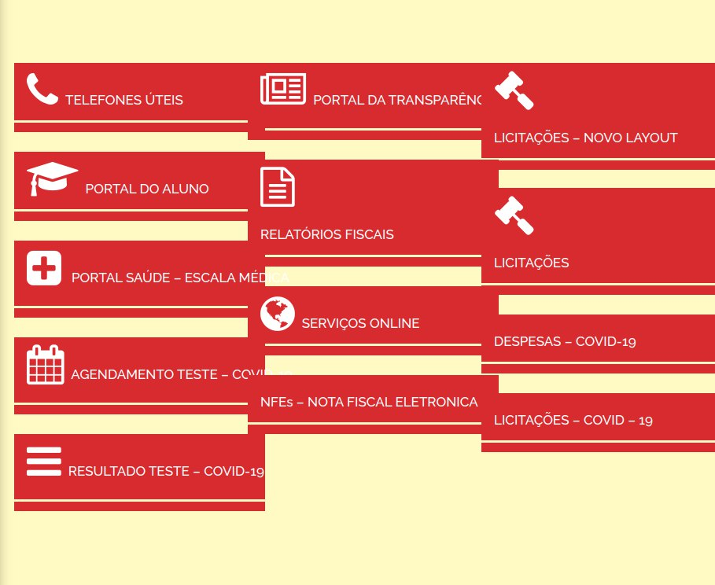

# Características da Plataforma

A plataforma escolhida é uma aplicação web do tipo Portal, onde os usuários podem navegar em busca de informações referentes à Prefeitura de Águas Lindas de Goiás.

## Compatibilidade 

A aplicação é compatível com os principais navegadores disponíveis para Mac, Windows e Linux, porém, apresenta mau funcionamento na versão mobile onde diversos bugs podem ser observados como a falta de resposta ao clicar na opção “menu”.

## Características negativas

Do ponto de vista de desempenho da interface, a plataforma falha na maioria dos aspectos tanto na versão mobile quanto na versão web, onde botões são mostrados em redundância, quase nenhum feedback visual é empregado causando confusão ao usuário. O tempo de resposta da mudança de página na plataforma varia de uma espera entre média e lenta, tanto na versão web, quanto na versão mobile.
  

Imagem 1 - Erro na disposição dos elementos do menu 
  

Imagem 2 - Elementos ultrapassam os limites da tela e de si mesmos

## Referências
+ Livro: BARBOSA, S. D. J.; SILVA, B. S. Interação Humano-Computador. 1ª edição, Rio de Janeiro: Elsevier, 2010.
+ Livro: MAYHEW,  D.J.  The  usability  engineering  lifecycle.  San Francisco, CA: Morgan Kaufmann. 1999. 

## Versionamento
| Data | Versão |           Descrição             |    Autor    |
|:----:|:------:|:-------------------------------:|:-----------:|
|08/10 |V0      |     Criação do documento        |Bruna Almeida|
|12/10 |V1      |   Análise das características da plataforma| Hugo Aragão|