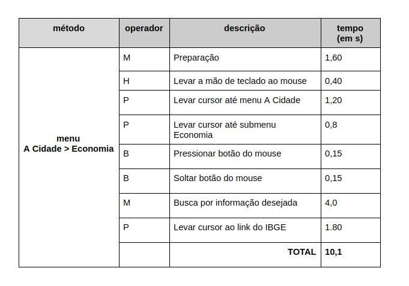

## Definição

 

**KLM** é definido como a técnica mais simples de **GOSM**, 
estruturada em um conjunto de operadores primitivos:

* **K** para pressionar tecla ou botão.
* **P** para apontar com o mouse um alvo num dispositivo.
* **H** para mover as mãos para o teclado ou outro dispositivo.
* **D** para desenhar um segmento de reta em um _grid_.
* **M** para se preparar mentalmente para realizar uma ação ou série de ações primitivas fortemente relacionadas entre si.
* **R** para o tempo de resposta do sistema, durante qual o usuário precisa esperar.

## Participantes
* Hugo Aragão

## Resultados

_Análise da Tarefa_: Acessar informações da Economia(PIB)

## Referências
* Livro: BARBOSA, S. D. J.; SILVA, B. S. Interação Humano-Computador. 1ª edição, Rio de Janeiro: Elsevier, 2010.

## Versionamento

| Data | Versão |           Descrição             |    Autor    |
|:----:|:------:|:-------------------------------:|:-----------:|
|01/10 |V0      |     Criação do documento        |Bruna Almeida|
|04/10 |V1      |     Análise KLM                 |Hugo Aragão  |