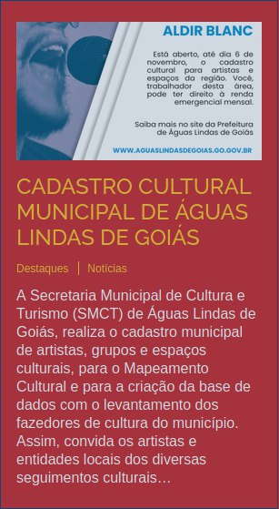
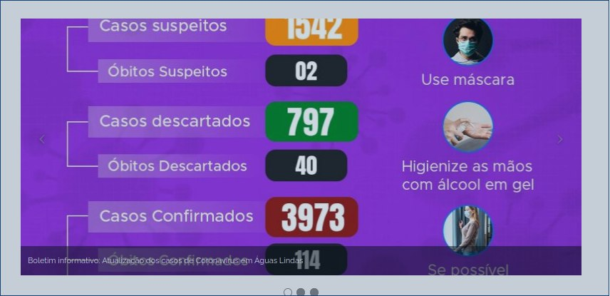

# Teste de usabilidade - Acessar informações da economia

### Preparação
A tarefa principal que o participante deve executar é a busca por 
informações do PIB da cidade de Aguas Lindas de Goiás.
O roteiro da avaliação consiste no participante ser informado sobre
a ação que ele deve executar e ao fim da ação, ele deve responder a 
um questionário a respeito da qualidade de uso, como no quadro abaixo:

|Impressões do participante                                       |
|:---------------------------------------------------------------:|
|Como você avalia a facilidade de distinguir os elementos do site?|
|Os ícones do site te auxiliaram na hora de encontrar o que desejava?|
|O design do site te agrada?                                      |
|O que te ajudou/atrapalhou mais na realização da tarefa?         |

#### Participante
A participante tem 45 anos, é professora de Geografia pós
graduada em Docência do Ensino Superior. Geralmente trabalha 
com alunos do Ensino Médio e utiliza cartazes e vídeos em suas
aulas. Possui baixo nível de conhecimento em informática.

#### Materiais
Os materiais utilizados na avaliação foram:
* Computador com acesso à internet
* Teclado/Mouse no padrão brasileiro
* Monitor de computador
* O site da prefeitura aberto em tela cheia
* Cadeira que permite ajuste para uma boa vizualização da tela
* Cronômetro para medir o tempo de cada ação

#### Teste piloto
O teste piloto foi realizado de forma que os materiais e o 
site fossem validados e assim avançar a avaliação com a participante.
O resultado foi satisfatório, a ação pôde ser feita sem interrupções
por parte dos equipamentos e do software.

### Coleta de dados
A participante foi orientada a sentar-se e informada de sua tarefa
a ser realizada, o aviso foi dado e o cronômetro disparado de modo
que a participante fosse autorizada a iniciar sua ação. O quadro
abaixo dispõe os pontos principais da execução da tarefa:

|Descrição da ação| Tempo em segundos               |
|:---------------:|:-------------------------------:|
|Acessar o mouse com a mão               |1.2       |
|Observar a pagina                       |3.3       |
|Levar curso até imagem(1)*              |3.1       |
|Levar cursor à imagem(2)*               |1.6       |
|Levar curso à imagem(3)*                |4.1       |
|Levar cursor ao menu                    |3.2       |
|Reconhecer os itens                     |5.7       |
|Navegar até o I. Portal do contribuinte |2.1       |
|Navegar até o I. Serviços               |1.8       |
|Ler os subitens de Serviços             |6.8       |
|Navegar/ler o I. RH                     |8.3       |
|Navegar/ler o I. Leis                   |9.5       |
|Navegar até o I. Contatos               |1.0       |
|Navegar até o I. Notícias               |1.2       |
|Navegar até o I. Governo                |0.5       |
|Navegar até o I. A Cidade               |0.8       |
|Levar o cursor até o subitem Economia   |1.2       |
|Clicar em Economia                      |0.5       |
|Total                                   |**55.9**  |

Legenda:

1. "I." quer dizer "item"

2. A imagem(x) está disposta nos anexos

### Interpretação e consolidação dos resultados

#### Perspectiva do participante
A participante se queixou de dificuldade de distiguir os itens 
do menu, o que a fez demorar mais que o normal para ler cada item, de
acordo com a mesma.

A respeito do Design, a participante comentou que não sentiu vontade
de voltar a usar o site por ser de difícil leitura dos elementos
e porque teve dificuldade de encontrar o que procurava.

Quanto aos ícones, a participante se queixou de ter demorado mais a
achar a opção desejada pois gastou bastante tempo refletindo se a opção
que estava a observar era a correta.

#### Observações técnicas
* O site apresenta falhas graves de usabilidade quando se observa o uso
  por usuários pouco familiares com o mesmo. 
* Os elementos estão dispostos de forma arbitrária e com acossiação fraca
  na relação nome/objetivo.
* O design do site está fora do padrão, o que faz com que os usuários não
  tenham vontade de usá-lo novamente.
* A disposição dos elementos do site causam confusão ao usuário, onde o mesmo 
  demora mais do que o normal para encontrar uma opção desejada no menu.

#### Sujestões de melhoria
* Trazer o site para um padrão de design mais atual fará com que o usuário se 
  sinta mais familiarizado com o modo com que o site funciona, diminuíndo o tempo
  de busca pela ferramenta desejada.
* Os nomes dos itens no menu devem ser reescritos e testados de forma que se use
  termos mais comuns ao cotidiano de um cidadão comum (o público alvo desse site).
* As cores do site devem ser revisadas e os elementos destiguidos de forma que o 
  contraste seja maior e os itens se tornem mais evidentes.

### Anexos

Imagem(1)

 

Imagem(2)
 

Imagem(3)
 

Imagem do Menu
 

### Referências

* Livro: BARBOSA, S. D. J.; SILVA, B. S. Interação Humano-Computador. 1ª edição, Rio de Janeiro: Elsevier, 2010.
* Site Prefeitura de Águas Lindas de Goiás acessado em: 28/10/2020 às 13:12. 

### Versionamento

| Data | Versão |           Descrição             |    Autor       |
|:----:|:------:|:-------------------------------:|:--------------:|
|28/10 |V0      |     Criação do documento        |Bruna Almeida   |
|28/10 |V1      |     Criação do Teste            |Hugo Aragão     |
